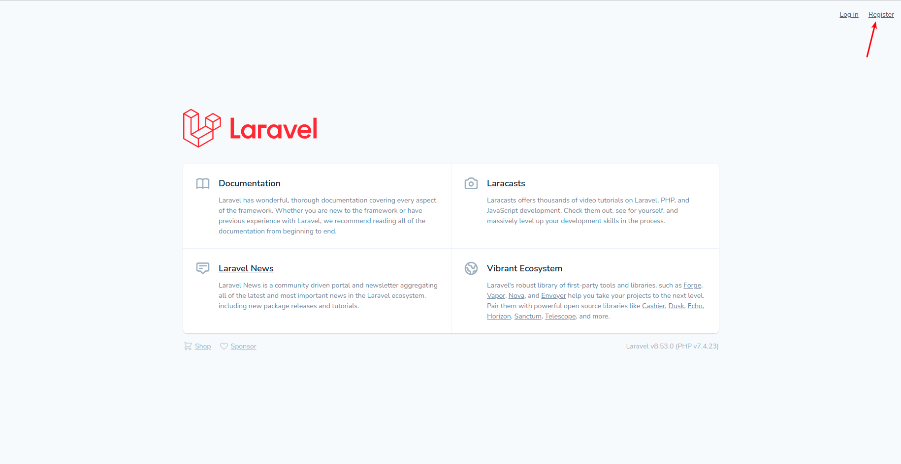
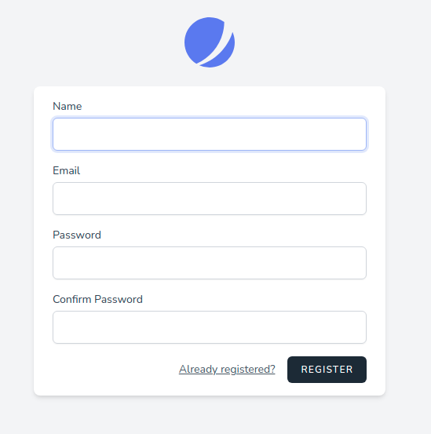
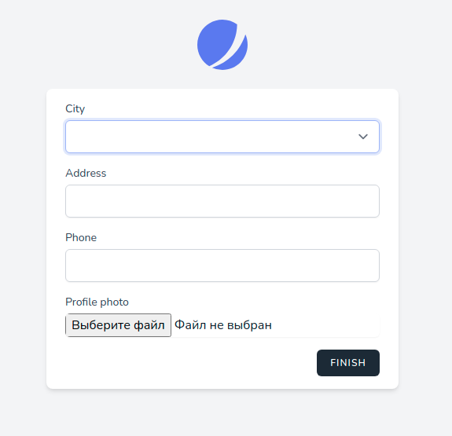

# Регистрация

Ссылка на регистрацию расположена в шапке приложения:

По клику открывается отдельная страница с формой:

* **Name** - произвольное имя пользователя
* **Email** - email пользователя, должен быть уникальным
* **Password** - пароль пользователя, длина не менее 8 символов
* **Confirm Password** - подтверждение пароля пользователя, должно быть равно значению в предыдущем поле

Все поля обязательны для заполнения.

После заполнения основных данных учётной записи необходимо пройти второй шаг регистрации:

* **City** - город местоположения пользователя, в котором будут доступны его предложения
* **Address** - адрес местоположения пользователя, на котором будут доступны его предложения
* **Phone** - контактный телефон пользователя
* **Profile photo** - аватар для профиля пользователя

Все поля, кроме аватара, обязательны для заполнения.

После завершения процесса регистрации пользователь будет аутентифицирован и может начать пользоваться сервисом.

---

Следующее: [Аутентификация](../05-auth/README.md)
