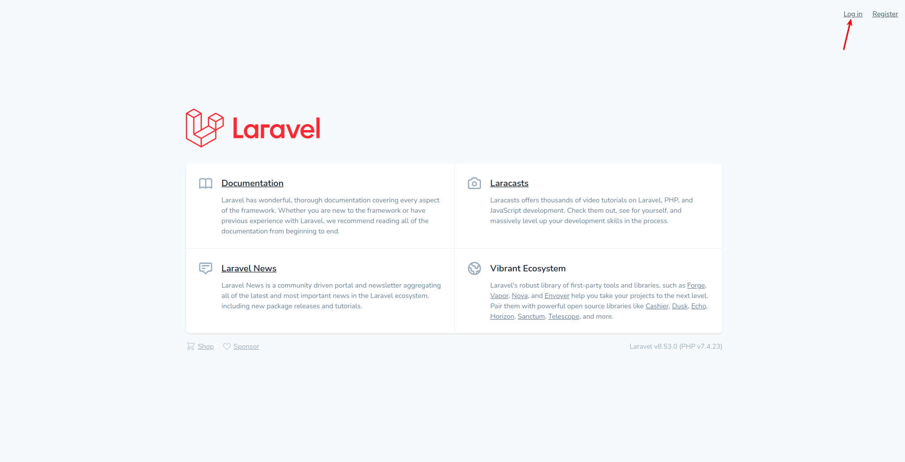
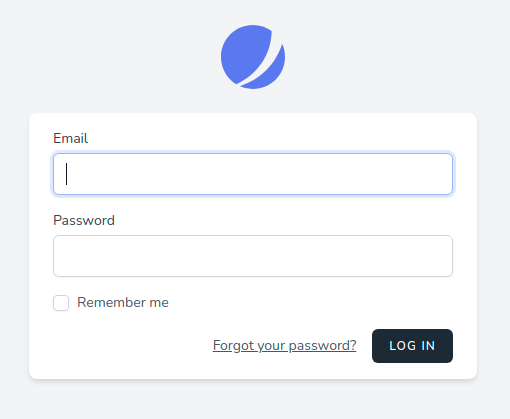
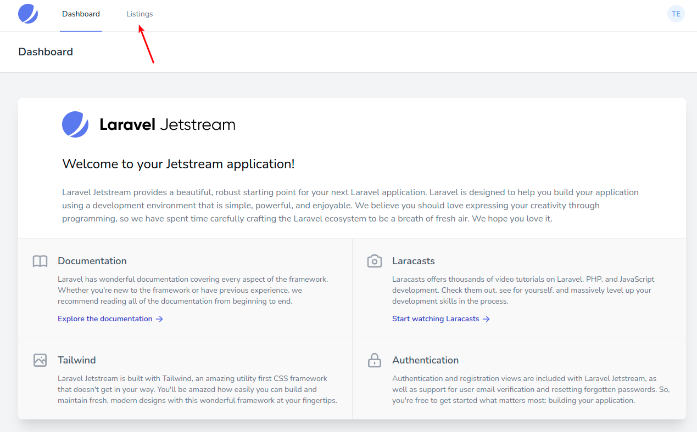
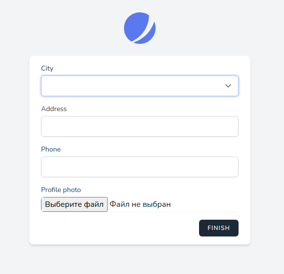

# Аутентификация

Ссылка на аутентификацию (*login*) расположена в шапке приложения:

По клику открывается отдельная страница с формой:

Если регистрация была пройдена полностью (первый и второй шаги), то после успешной аутентификации происходит переадресация на главную страницу личного кабинета пользователя:

В противном случае будет предложено пройти второй шаг регистрации:

Без полного прохождения регистрации авторизованный пользователь не сможет пользоваться приложением.

---

Следующее: [Просмотр предложений](../06-listings/README.md)
