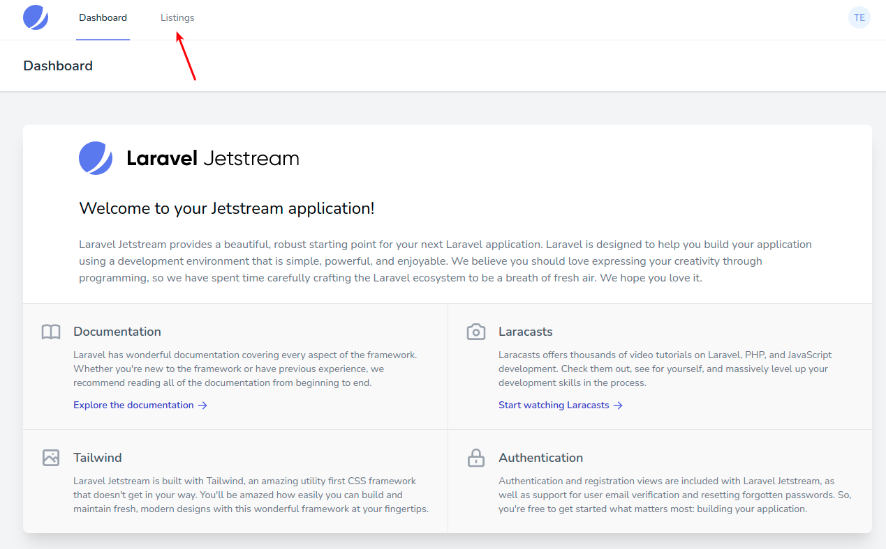
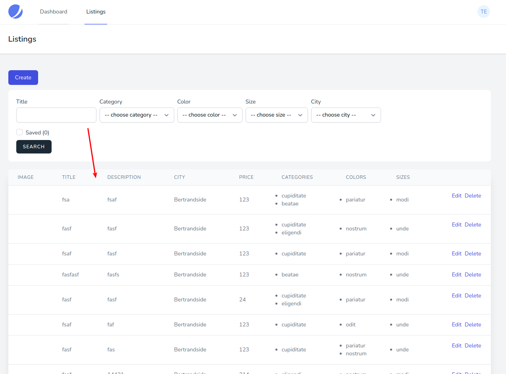
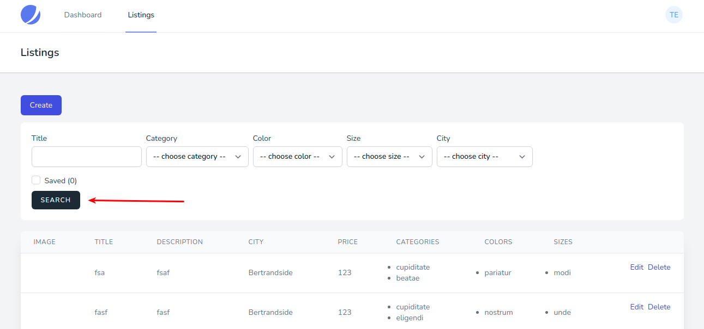
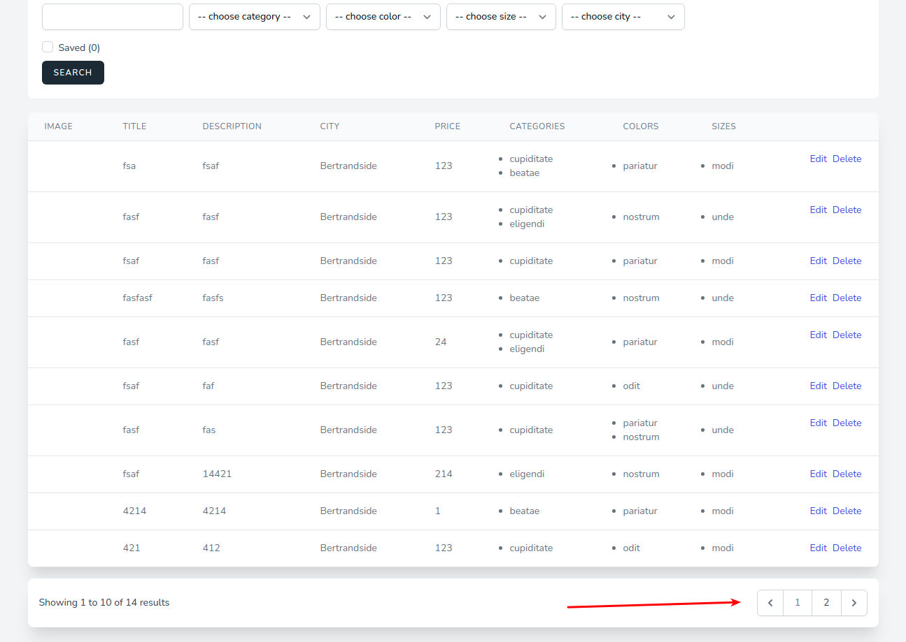

# Просмотр предложений

Раздел со списком предложений доступен в меню авторизованного пользователя:

Здесь перечислены все созданные пользователями предложения:

Для фильтрации списка существует специальный блок опций:

* **Title** - фильтрация по названию (поиск типа *like*, по вхождению значения)
* **Category** - фильтрация по категории
* **Color** - фильтрация по цвету
* **Size** - фильтрация по размеру
* **City** - фильтрация по городу авторов предложений
* **Saved** - фильтрация по предложениям, добавленным в [избранное](../10-favourite-listing/README.md)

Когда количество предложений превышает 10 единиц (значение по-умолчанию), на странице появляется блок с пагинацией:

---

Следующее: [Создание предложения](../07-create-listing/README.md)
