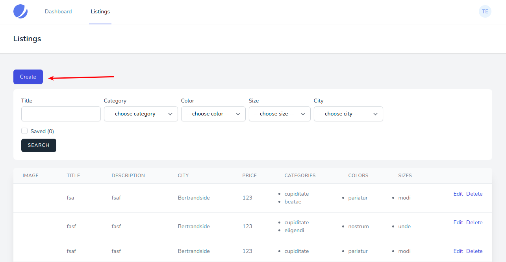
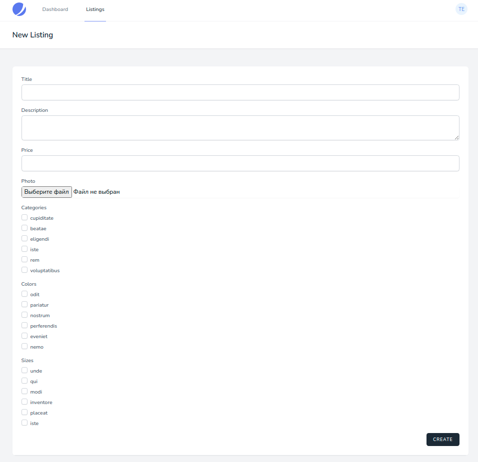

# Создание предложения

Для создания предложения необходимо перейти в [список всех предложений](../06-listings/README.md) и нажать соответствующую кнопку:

* **Title** - название предложения
* **Description** - описание предложения
* **Price** - стоимость предложения
* **Photo** - изображение предложения
* **Categories** - категории предложения
* **Colors** - цвета предложения
* **Sizes** - размеры предложения

Все поля, кроме **Photo** являются обязательными для заполнения.

После создания предложения, оно появится в общем списке предложений.

---

Следующее: [Редактирование предложения](../08-edit-listing/README.md)
