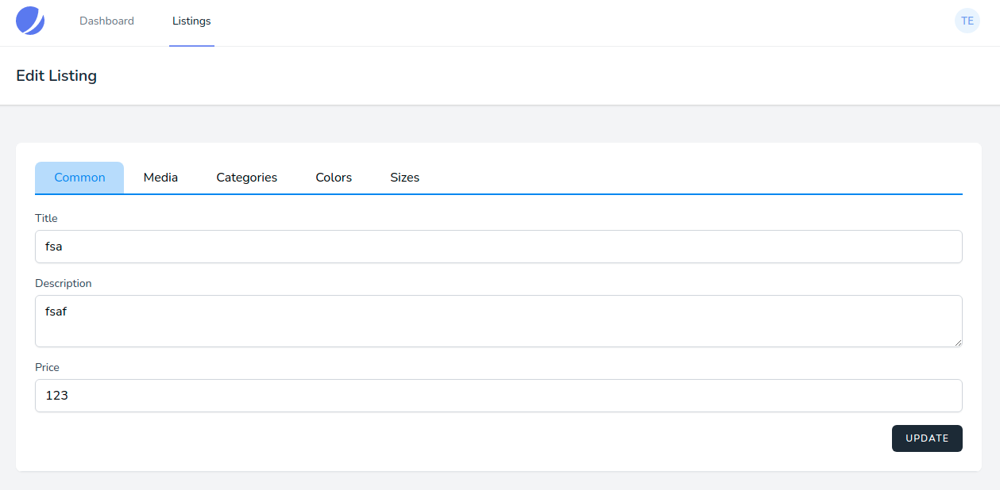

# Редактирование предложения

Для редактирования предложения необходимо перейти в [список всех предложений](../06-listings/README.md).

Для редактирования доступны только собственные предложения, рядом с ними появится соответствующая ссылка:

Редактирование предложения разбито по категориям:

* **Common** - общие свойства предложения
* **Media** - изображения предложения. Можно добавить несколько изображений
* **Categories** - категории изображения
* **Colors** - цвета изображения
* **Sizes** - размеры изображения

---

Следующее: [Удаление предложения](../09-delete-listing/README.md)
