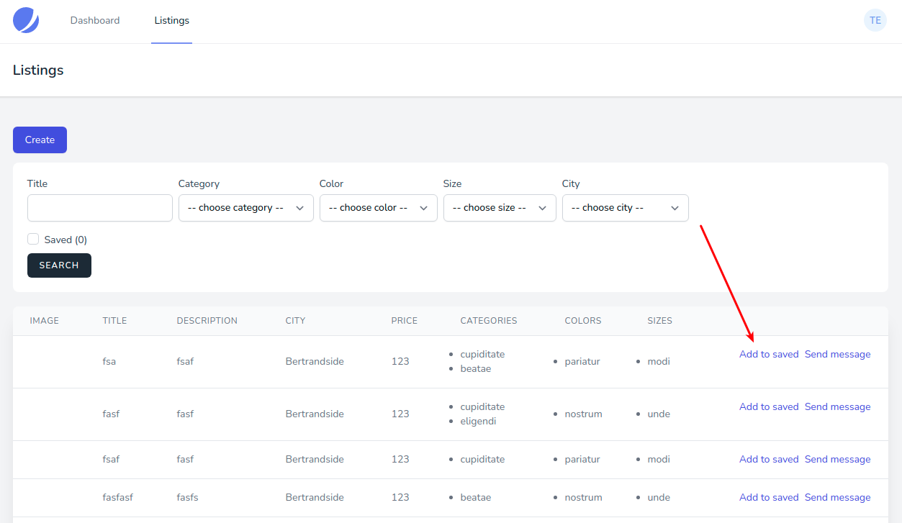
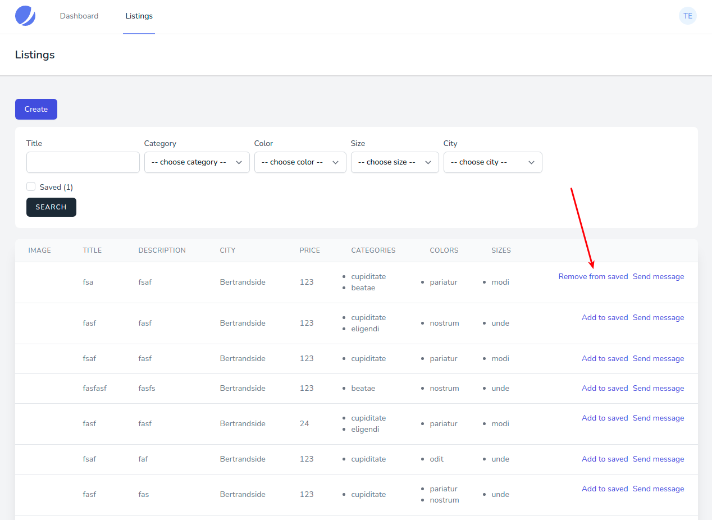
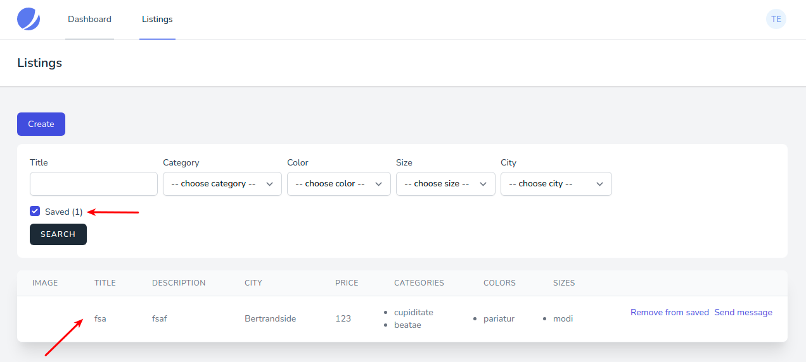

# Добавление предложения в избранное

Для добавления предложения в избранное необходимо перейти в [список всех предложений](../06-listings/README.md).

Для добавления в избранное доступны только предложения других пользователей, рядом с ними появится соответствующая ссылка:

Добавленное ранее в избранное предложение можно удалить из избранного:

Также список всех предложений можно отфильтровать по избранным (будут показаны только добавленные в избранное предложения):

---

Следующее: [Отправка сообщения автору предложения](../11-send-message/README.md)
