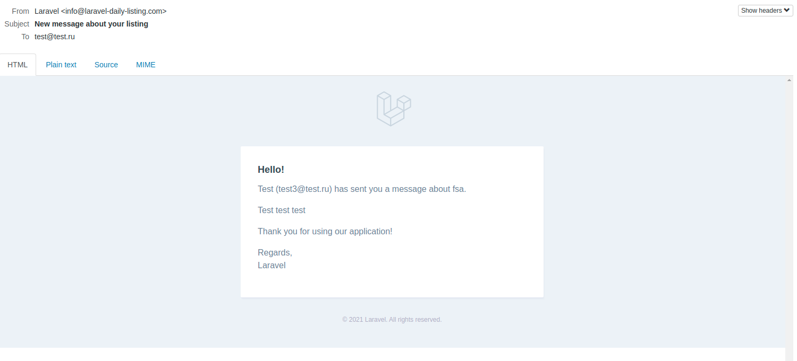

# Отправка сообщения автору предложения

Для отправки сообщения автору предложения необходимо перейти в [список всех предложений](../06-listings/README.md).

Рядом с предложениями других пользователей появится соответствующая ссылка:

Далее, нужно заполнить текст сообщения в форме на открывшейся странице:

Автор предложения получит письмо на указанный email:

Существует ограничение на отправку сообщений пользователем - не более одного в минуту.
